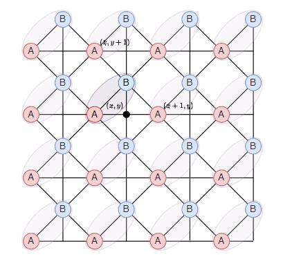
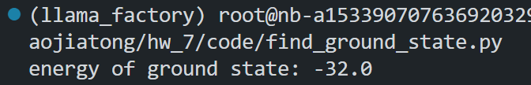

# 
 Computational_Physics_7

## $\mathbf{A.}$阻挫Ising模型

考虑方晶格上面的下列反铁磁Ising模型，每个元胞包含两个子格。

系统的哈密顿量为：
$$H = \frac{1}{2} J \sum_{(i,j) \in \text{bonds}} s_i s_j, \quad J > 0$$
其中bonds代表所有有bond的邻居，例如对图中(x,y)处的元胞，A子格具有4个B邻居和2个A邻居。
现在考虑$J=1$. 取周期边界条件，系统两个方向的尺寸相同，即$L_x = L_y = L$.

### 问题 1：找出系统的基态构型规则。这个模型的基态简并吗？(1分)

#### 基态构型规则：

根据题目所给哈密顿量：
\[
H = \frac{1}{2} J \sum_{(i,j) \in \text{bonds}} s_i s_j, \quad J = 1
\]
该模型是一个二维方晶格上的反铁磁 Ising 模型，其中每个元胞包含两个子格（A 和 B），存在 A–A、A–B、B–B 的耦合。用“灰格子”指代图中的中间有十字交叉的格子：

则基态构型规则为：

> **每一个灰格子四个顶点（2A + 2B）上的自旋值之和为 0。**

具体来说，由于自旋 \( s_i \in \{-1, +1\} \)，要满足这个条件，只有以下几类组合可能：
- (+1, +1, -1, -1)
- (+1, -1, +1, -1)
- (+1, -1, -1, +1)
- 及其对称旋转

这表示灰格子中必须恰好包含两个 \( +1 \) 和两个 \( -1 \) 的自旋，从而满足局域能量最小化。

>**构型规则总结：**  
> **系统的基态要求每一个灰格子中的 4 个顶点（2 个 A 子格和 2 个 B 子格）自旋值之和为 0，即每个灰格子中有两个 \( +1 \) 和两个 \( -1 \) 的自旋。**

#### 基态是否简并？

由于每个灰格子允许多个满足条件的自旋配置（例如 \((+1, +1, -1, -1)\)、\((+1, -1, +1, -1)\)、\((+1, -1, -1, +1)\) 等），且整个系统包含 \( L \times L \) 个灰格子，因此：

- 各个灰格子之间的构型选择存在一定自由度
- 整体系统可以在多个满足局部灰格子条件的全局配置中选择

这意味着系统具有大量等能量的基态。

> **结论：**
> 该模型的基态是高度简并的，简并度随着系统尺寸指数增长。

---

### 问题 2：计算边长为 $L$ 的模型的基态能量

系统的哈密顿量为：
\[
H = \frac{1}{2} J \sum_{(i,j) \in \text{bonds}} s_i s_j, \quad J = 1
\]
其中每条边只被计算一次。我们需要统计系统中所有边的总数，并估算基态下每条边的能量贡献。

#### 邻接关系和耦合类型

从图中可以看出：

- 每个元胞包含两个子格：一个 A，一个 B，总共 $2L^2$ 个自旋
- 每个 A 子格连接：
  - 4 个 B 邻居（上下左右方向）
  - 2 个 A 邻居（对角线方向）
- 每个 B 子格连接：
  - 4 个 A 邻居（上下左右方向）
  - 2 个 B 邻居（对角线方向）

我们将所有耦合分为三类：A–A、A–B、B–B。

#### 边数统计（避免重复）

- 每条边只计算一次，因此统计每类边的总数时需注意重复：

1. **A–A 边**  
   每个 A 与 2 个 A 邻居相连，但每条边会被两个 A 重复统计：  
   \[
   N_{AA} = \frac{1}{2} \times L^2 \times 2 = L^2
   \]

2. **B–B 边**  
   每个 B 与 2 个 B 邻居相连，同理：  
   \[
   N_{BB} = \frac{1}{2} \times L^2 \times 2 = L^2
   \]

3. **A–B 边**  
   每个 A 与 4 个 B 邻居相连，总共 $L^2$ 个 A 子格：
   \[
   N_{AB} = \frac{1}{2} \times L^2 \times 4 = 2L^2
   \]

#### 总边数
\[
N_{\text{bonds}} = N_{AA} + N_{AB} + N_{BB} = L^2 + 2L^2 + L^2 = 4L^2
\]

#### 每条边的基态能量贡献

在基态中，每对相邻自旋反向排列（$s_i s_j = -1$），从而使每条边的能量最小：

\[
E_{\text{bond}} = \frac{1}{2} \cdot J \cdot s_i s_j = \frac{1}{2} \cdot (-1) = -\frac{1}{2}
\]

#### 基态总能量

\[
E_0 = -\frac{1}{2} \times N_{\text{bonds}} = -\frac{1}{2} \times 4L^2 = -2L^2
\]

#### 结论

系统边长为 $L$ 的方格模型，其基态总能量为：
\[
\boxed{E_0 = -2L^2}
\]

3. 在零温度下，简并的不同基态是等可能性出现的。现在寻找一个方法，尽可能地采样不同的基态构型。写出你的思路和方法，并给出代码。(3分)
4. 具体呈现3个不同的基态构型，验证它们都满足（1）中你发现的规则，验证能量是否是理论值。(1分)
5. 关联函数 计算基态的关联函数：
$$
C^{\mu\nu}(\mathbf{r}) = \langle s^\mu(\mathbf{R}) \cdot s^\nu(\mathbf{R} + \mathbf{r}) \rangle_{\mathbf{R}}$$
其中$\mu, \nu \in (A, B)$. 作平均时，$\mathbf{R}$取遍所有正格矢，而$\mathbf{r}$也取正格矢。用热力图画出这个关联函数。(1分) 观察关联函数在x, y和对角线方向的值，你发现了什么规律？(2分)
6. 你能解释你发现的规律吗？(1分)