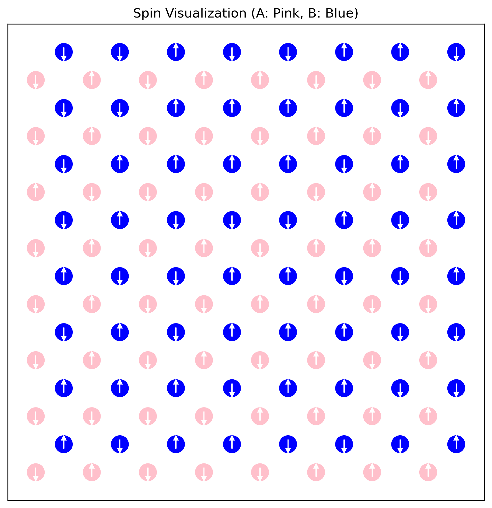
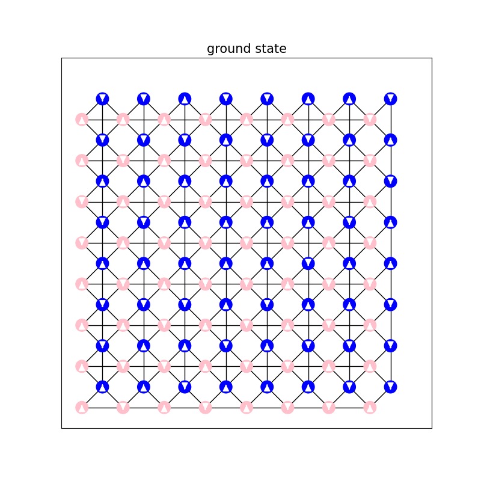
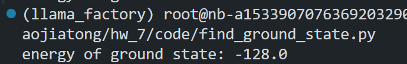
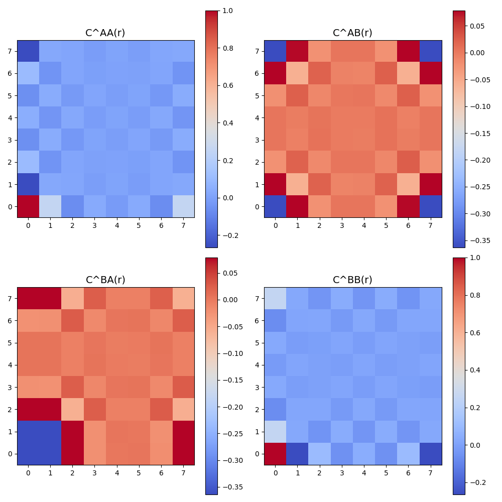

# <center> Computational_Physics_7

## $\mathbf{A.}$阻挫Ising模型

考虑方晶格上面的下列反铁磁Ising模型，每个元胞包含两个子格。

系统的哈密顿量为：
$$H = \frac{1}{2} J \sum_{(i,j) \in \text{bonds}} s_i s_j, \quad J > 0$$
其中bonds代表所有有bond的邻居，例如对图中(x,y)处的元胞，A子格具有4个B邻居和2个A邻居。
现在考虑$J=1$. 取周期边界条件，系统两个方向的尺寸相同，即$L_x = L_y = L$.


### 问题 1：找出系统的基态构型规则。这个模型的基态简并吗？(1分)

#### 基态构型规则：

根据题目所给哈密顿量：
\[
H = \frac{1}{2} J \sum_{(i,j) \in \text{bonds}} s_i s_j, \quad J = 1
\]
该模型是一个二维方晶格上的反铁磁 Ising 模型，其中每个元胞包含两个子格（A 和 B），存在 A–A、A–B、B–B 的耦合。用“灰格子”指代图中的中间有十字交叉的格子：

则基态构型规则为：

> **每一个灰格子四个顶点（2A + 2B）上的自旋值之和为 0。**

具体来说，由于自旋 \( s_i \in \{-1, +1\} \)，要满足这个条件，只有以下几类组合可能：
- (+1, +1, -1, -1)
- (+1, -1, +1, -1)
- (+1, -1, -1, +1)
- 及其对称旋转

这表示灰格子中必须恰好包含两个 \( +1 \) 和两个 \( -1 \) 的自旋，从而满足局域能量最小化。

>**构型规则总结：**  
> **系统的基态要求每一个灰格子中的 4 个顶点（2 个 A 子格和 2 个 B 子格）自旋值之和为 0，即每个灰格子中有两个 \( +1 \) 和两个 \( -1 \) 的自旋。**


#### 基态是否简并？

由于每个灰格子允许多个满足条件的自旋配置（例如 \((+1, +1, -1, -1)\)、\((+1, -1, +1, -1)\)、\((+1, -1, -1, +1)\) 等），且整个系统包含 \( L \times L \) 个灰格子，因此：

- 各个灰格子之间的构型选择存在一定自由度
- 整体系统可以在多个满足局部灰格子条件的全局配置中选择

这意味着系统具有大量等能量的基态。

> **结论：**
> 该模型的基态是高度简并的，简并度随着系统尺寸指数增长。

---
### 问题 2：计算边长为 $L$ 的模型的基态能量

根据题目和图像分析，我们知道每个“格子”包含 4 条边，分别是：

- **A–B 边**：每条 A 和 B 相邻的自旋是相反的，因此每条边的贡献是 $-1$。
- **A–A 边**：每条 A–A 边的自旋相同，因此每条边的贡献是 $+1$。
- **B–B 边**：每条 B–B 边的自旋相同，因此每条边的贡献是 $+1$。

因此，每个格子的总能量为：
\[
E_{\text{每个格子}} = 4 \times (-1) + 2 \times (+1) = -4 + 2 = -2
\]

>此处补充说明：本人认为题目中的定义中的$\frac{1}{2}$的存在是为了避免同一连接的重复计算，此处的做法已经规避了这一重复，因此不需要再乘$\frac{1}{2}$。

#### 系统总能量

系统有 $L^2$ 个格子，因此总的基态能量为：
\[
E_0 = -2 \times L^2
\]

#### 结论

基态下系统的总能量为：
\[
\boxed{E_0 = -2L^2}
\]

---

## 问题三：零温度下的基态采样方法

### 问题描述

在零温度极限下，系统趋于基态。但由于本题的系统存在**大量简并基态**，单次模拟只能采样出其中一个。为了探索更多的基态构型，我们需要提出一种策略，使得在不同运行中，能够采样到不同的简并基态，从而更全面地理解系统的低温行为。


### 思路与方法

1. **随机初始状态**：我们每次运行 Monte Carlo 模拟时，都以**完全随机的自旋配置**作为初始状态。由于系统自旋态数量为 $2^{2N^2}$，随机初始化可以带来充分的初态多样性。

2. **零温极限模拟**：
   - 采用 Metropolis 更新策略；
   - 当能量变化 $\Delta E < 0$ 时，一定接受更新；
   - 当 $\Delta E > 0$ 时，有一定概率更新，是否更新取决于和随机数w的大小比较
   - 实现等价于仅接受能量降低的过程，系统最终陷入一个局部甚至全局基态。

3. **多次独立采样**：我们通过多次重复上述过程，并保存最终的自旋构型，可以采样出多个可能的基态。

4. **可视化验证**：我们通过 `visualize_spin()` 函数展示不同运行得到的自旋构型，并直观判断它们之间的差异。

> 代码见附录

---

## 问题四 具体呈现并验证
具体呈现3个不同的基态构型，验证它们都满足（1）中你发现的规则，验证能量是否是理论值。(1分)

取L=8,由问题三中方法得到的三个基态展示如下：

<!-- 

 -->




不难看出，以上三个基态:
1. **均满足问题一中发现的规律**：
>**构型规则总结：**  
> **系统的基态要求每一个灰格子中的 4 个顶点（2 个 A 子格和 2 个 B 子格）自旋值之和为 0，即每个灰格子中有两个 \( +1 \) 和两个 \( -1 \) 的自旋。**

2. 计算以上**三个构型的能量**，发现当“灰格点”的数目为$L^2$时，理论能量为$-2L^2$,符合理论值。
<!--  -->



## 问题五 计算自旋关联函数 C^{μν}(r)

 <!-- 5. 关联函数 计算基态的关联函数： 
 $$
C^{\mu\nu}(\mathbf{r}) = \langle s^\mu(\mathbf{R}) \cdot s^\nu(\mathbf{R} + \mathbf{r}) \rangle_{\mathbf{R}}$$
其中$\mu, \nu \in (A, B)$. 作平均时，$\mathbf{R}$取遍所有正格矢，而$\mathbf{r}$也取正格矢。用热力图画出这个关联函数。(1分) 观察关联函数在x, y和对角线方向的值，你发现了什么规律？(2分) -->

在二维正方晶格上，我们对每一对 μ ∈ {A, B}, ν ∈ {A, B} 的子格子自旋，计算它们之间在相对位移 r 处的平均乘积，即关联函数：

$$
C^{\mu\nu}(\mathbf{r}) = \langle s^\mu(\mathbf{R}) \cdot s^\nu(\mathbf{R} + \mathbf{r}) \rangle_{\mathbf{R}}
$$

为此，我们对晶格中的所有 R 点枚举，使用周期性边界条件处理 \(\mathbf{R} + \mathbf{r}\) 越界情况，最终将结果归一化。

我们分别绘制了四种组合的关联函数热力图 \(C^{AA}(r)\), \(C^{AB}(r)\), \(C^{BA}(r)\), \(C^{BB}(r)\)。如下图所示：



为了防止偶然性，取N=20，得到相关函数的热力图如下：


### 发现的规律

1. **在\(C^{AA}(r)\) 和 \(C^{BB}(r)\)中** ：
    - 整体上关联函数为负，说明相同格点更倾向于呈现一个“反自旋”的关系
    - 在x,y方向上呈现明显周期性，表现出“一强一弱”的明显特征。
    - 在对角方向上，我们发现某些模式保持对称，即对角线上的关联函数趋向于相等。
    - \(C^{AA}(r)\) 和 \(C^{BB}(r)\)均表现出“格子状”的特征
    - \(C^{AA}(r)\) 和 \(C^{BB}(r)\)的关联函数模式热图非常相似，说明A、B格点没有实质上的区别，地位上是相同的。
2. **在\(C^{AB}(r)\) 和 \(C^{BA}(r)\)中**：
    - \(C^{AB}(r)\) 和 \(C^{BA}(r)\)模式图是相同的，这符合我们前面“周期性边界条件”的设定
    - 在x,y方向上呈现明显周期性，表现出“一强一弱”的明显特征，比如A和相邻的B之间的关联系数很小，和次相邻的B之间的关联系数很大
    - 在对角线上的关联系数很接近
    - 整体上表现出一个格子状的特征
    - \(C^{AB}(r)\) 和 \(C^{BA}(r)\)模式图表现出辐射状对称，如下图所示（将(0,0)点置于中间）：
    
这些结构反映了体系中的反铁磁特征，表明系统处于高度有序的低温基态。


<!-- 
在问题五中，我们计算了自旋关联函数：
$$
C^{\mu\nu}(\mathbf{r}) = \langle s^\mu(\mathbf{R}) \cdot s^\nu(\mathbf{R} + \mathbf{r}) \rangle_{\mathbf{R}}, \quad \mu,\nu \in \{A, B\}
$$
并绘制了 \(C^{AA}(r)\)、\(C^{BB}(r)\)、\(C^{AB}(r)\)、\(C^{BA}(r)\) 的热力图。

根据热力图观察，我们发现如下规律：

1. **A–A 和 B–B 关联函数（如 \(C^{AA}(r)\) 和 \(C^{BB}(r)\)）在 x 和 y 方向上呈现出明显的周期性对称结构**。这反映出在同一子格内部，自旋排布具有较强的规则性，例如交替的反铁磁排列模式。例如A格点倾向于和相邻的A有相反的自旋方向，和次相邻的A格点有相同的自旋方向。

2. **A–B 和 B–A 的关联函数（如 \(C^{AB}(r)\)、\(C^{BA}(r)\)）显示出明显的反相关行为**。这与系统哈密顿量中 A–B 耦合为反铁磁性一致，说明相邻 A、B 子格自旋倾向于取相反方向。

3. **在对角线方向上也可见周期结构和对称性**，暗示了系统不仅在笛卡尔轴方向上有序，也在更广泛的晶格方向上体现出基态的对称性与周期性。 -->

<!-- 
#### 总结

这些规律的出现可以用以下物理图像解释：

- 系统处于零温度极限，进入高度有序的基态；
- 哈密顿量中 A–B 强反铁磁耦合导致相邻子格自旋反向；
- 自旋排列需满足“每个灰格子自旋和为零”的局部约束，因此引入长程有序性；
- 整体系统表现出准周期性和子格间反相关的格局。

因此，相关函数的结构直接反映出系统在基态下的几何约束与能量最小化原则，是自旋阻挫系统中局部-全局一致性的体现。 -->

## 问题六：解释发现的规律 (1分)

在第五题中，我们计算并可视化了四种类型的自旋关联函数：

- \( C^{AA}(\mathbf{r}) \)
- \( C^{BB}(\mathbf{r}) \)
- \( C^{AB}(\mathbf{r}) \)
- \( C^{BA}(\mathbf{r}) \)

这些关联函数在空间方向上展示出特定的周期性、反对称性和对角对称性，体现出体系在基态下的空间关联性质。以下是对这些规律的物理解释：


### 1. **反铁磁相互作用导致反相关行为**

哈密顿量中采用了反铁磁耦合项（\( J=1 > 0 \)），即相邻自旋倾向于反向排列。因此：

- 相邻的 A–B 子格之间的自旋倾向相反，使得 \( C^{AB}(\mathbf{r} = 0) < 0 \)
- 沿着直接相邻的格点方向(A-B,B-A)自旋相关性比较强，关联函数表现出明显的负值，当距离较远时相关性减弱，绝对值趋于0
- 同类子格（A–A 或 B–B）的相邻格点自旋相反，使得 \( C^{AA}(\mathbf{r}) \) 和 \( C^{BB}(\mathbf{r}) \) 为负值，这样造成了**周期性**，即相距为偶数的关联函数更低，相距为奇数的关联函数更高。同时这也能解释**对角线相趋同**的原因。
- 在当前模型中，由于晶格是方形的且耦合各向同性(J 在所有方向相同),关联函数的衰减在 x 和 y 方向应是对称的。如果存在各向异性(如不同方向的 J 不同),热力图中特定方向的关联强度可能更突出。
- 同子格自旋间直接相互作用相比异子格较弱(模型定义中仅 A-B 子格耦合),因此同
子格关联主要由间接效应(如多体相互作用)贡献，通常较弱。而异子格关联直接由
反铁磁耦合主导。


### 2. **局域构型规则限制了自旋排列**

由于每一个灰格子必须满足**2 个 +1 与 2 个 −1**的规则（即每格子自旋和为 0），这对局部构型施加了强约束：

- 这种局域限制在全局上产生非平凡的长程关联，即便没有直接耦合，自旋间也会通过中间元胞产生关联
- 这解释了为什么即使在 \( |\mathbf{r}| \) 较大时，\( C^{\mu\nu}(\mathbf{r}) \) 仍然有结构性而非完全衰减为 0


### 3. **周期边界条件与格点对称性**

由于周期边界条件和子格结构对称性：

- \( C^{AB}(\mathbf{r}) = C^{BA}(-\mathbf{r}) \)，使得 AB 与 BA 的图像呈镜像对称
- \( C^{AA} \) 与 \( C^{BB} \) 图像几乎相同，说明 A 与 B 子格在全局排列中是等价的
- 在对角线方向上表现出的对称性与整个晶格的 \( C_4 \) 对称群有关，即晶格在 90° 旋转下不变


### 4. **周期性格子排列导致空间上的格点调制**

由于晶格是规则排列的方格结构，格点间距固定、耦合规则一致，导致：

- 关联函数在空间方向上具有周期性（如横向和纵向上的“格子状”结构）
- 形成明显的强弱交替模式，类似于在周期性势场中电子密度的布拉格调制


### 总结

> 基态自旋构型同时满足反铁磁耦合和局域限制条件，导致了长程、周期性的关联函数结构。  
> 这些现象不仅揭示了基态的有序性，也体现了自旋系统中「简并约束」与「耦合竞争」之间的微妙平衡。


---
## 附录
### 求解基态

```python
import numpy as np
import matplotlib.pyplot as plt

import numpy as np
import matplotlib.pyplot as plt
from matplotlib.patches import FancyArrowPatch, Circle


# 取格点尺寸大小为N，计算基态
# 通过三维数组【N,N,2]来分别代表A,B两种格点

def ising_monte_carlo(N:int,step:int)->np.ndarray:
    """
    用于计算基态，使用蒙特卡洛方法，
    """
    system = np.random.choice([-1, 1], size=(2,N, N))
    # print(system)
    for step_num in range(step):
        type_gedian = np.random.randint(0, 2) #0代表A，1代表B
        # 随机选取一个格点
        i, j = np.random.randint(0, N, 2)
        energy_change = calculate_energy_change_in_neighbors(system, i, j, type_gedian,N)
        w = calculate_change_possibility(energy_change)
        if np.random.rand() < w:
            system[type_gedian, i, j] *= -1
    return system


def calculate_energy_change_in_neighbors(system:np.ndarray,x:int,y:int,type_gedian:int,N:int)->int:
    """
    计算邻居的能量变化
    """
    neighbor = find_neibor(x,y,type_gedian,N)
    energy_old = 0
    for type_gedian_nei,x_nei,y_nei in neighbor:
        energy_old += system[type_gedian_nei,x_nei,y_nei] * system[type_gedian,x,y]
    

    return  energy_old*-2


def calculate_energy_in_neighbors(system:np.ndarray,x:int,y:int,type_gedian:int,N:int)->int:
    """
    计算邻居的能量变化
    """
    neighbor = find_neibor(x,y,type_gedian,N)
    # print(f"for {type_gedian} in {x},{y},neighbor num is {len(neighbor)}")
    energy = 0
    for type_gedian_nei,x_nei,y_nei in neighbor:
        energy += system[type_gedian_nei,x_nei,y_nei] * system[type_gedian,x,y]
    
   
    return  energy


def calculate_change_possibility(energy_change:int,T=1e-30)->float:
    """
    计算能量变化的可能性
    """
    beta = 1/T
    if energy_change < 0:
        return 1.0
    else:
        return np.exp(-energy_change*beta)


def visualize_spin(spin: np.ndarray, N: int):
    """
    使用 FancyArrowPatch 可视化 AB 格点的自旋状态。
    
    参数:
        spin: np.ndarray, 形状为 (2, N, N)，第一维为 A/B 子格。
        N: int, 元胞的边长数量。
    """
    fig, ax = plt.subplots(figsize=(8, 8))

    for i in range(N):
        for j in range(N):
            # A 格点
            x_a, y_a = 2 * i, 2 * j
            s_a = spin[0, i, j]
            ax.add_patch(Circle((x_a, y_a), 0.3, color='pink', zorder=2))

            arrow_a = FancyArrowPatch(
                (x_a, y_a), (x_a, y_a + 0.2 * s_a),
                arrowstyle='-|>',
                color='white',
                mutation_scale=15,
                linewidth=1.5,
                zorder=3
            )
            ax.add_patch(arrow_a)

            # B 格点
            x_b, y_b = 2 * i + 1, 2 * j + 1
            s_b = spin[1, i, j]
            ax.add_patch(Circle((x_b, y_b), 0.3, color='blue', zorder=2))

            arrow_b = FancyArrowPatch(
                (x_b, y_b), (x_b, y_b + 0.2 * s_b),
                arrowstyle='-|>',
                color='white',
                mutation_scale=15,
                linewidth=1.5,
                zorder=3
            )
            ax.add_patch(arrow_b)

    # 添加 A-A 横向黑线
    for i in range(N - 1):
        for j in range(N):
            x1, y1 = 2 * i, 2 * j
            x2, y2 = 2 * (i + 1), 2 * j
            ax.plot([x1, x2], [y1, y2], color='black', linewidth=1, zorder=1)

    # 添加 B-B 纵向黑线
    for i in range(N):
        for j in range(N - 1):
            x1, y1 = 2 * i + 1, 2 * j + 1
            x2, y2 = 2 * i + 1, 2 * (j + 1) + 1
            ax.plot([x1, x2], [y1, y2], color='black', linewidth=1, zorder=1)

    # B 到周围四个 A 的连线
    for i in range(N):
        for j in range(N):
            x_b, y_b = 2 * i + 1, 2 * j + 1
            neighbors = [
                (x_b - 1, y_b + 1),  # 左上
                (x_b - 1, y_b - 1),  # 左下
                (x_b + 1, y_b + 1),  # 右上
                (x_b + 1, y_b - 1)   # 右下
            ]
            for x_a, y_a in neighbors:
                if 0 <= x_a < 2 * N and 0 <= y_a < 2 * N:
                    ax.plot([x_b, x_a], [y_b, y_a], color='black', linewidth=1, zorder=1)

    ax.set_xlim(-1, 2 * N + 1)
    ax.set_ylim(-1, 2 * N + 1)
    ax.set_xticks([])
    ax.set_yticks([])
    ax.set_aspect('equal')
    ax.grid(False)
    plt.title("ground state",fontsize=15)

    path = "./image/show_ground_state_fancyarrow_3.png"
    plt.savefig(path)
    plt.close()
def find_neibor(i:int, j:int, type_gedian:int, N:int) -> list:
    """
    找到格点的邻居（使用整除处理周期性边界条件）
    """
    neighbor = []

    if type_gedian == 0:
        # A 格点邻居：AA 横向 + AB 右上、右下、下方、左下三个
        neighbor.append((0, (i - 1) % N, j))      # A 左
        neighbor.append((1, (i - 1) % N, j))      # B 左下
        neighbor.append((0, (i + 1) % N, j))      # A 右
        neighbor.append((1, i, j))                # B 正下
        neighbor.append((1, i, (j - 1) % N))      # B 左
        neighbor.append((1, (i - 1) % N, (j - 1) % N))  # B 左下角

    elif type_gedian == 1:
        # B 格点邻居：BB 上下 + BA 左、右、右上、上
        neighbor.append((0, i, j))                # A 中
        neighbor.append((1, i, (j - 1) % N))      # B 下
        neighbor.append((1, i, (j + 1) % N))      # B 上
        neighbor.append((0, i, (j + 1) % N))      # A 上
        neighbor.append((0, (i + 1) % N, j))      # A 右
        neighbor.append((0, (i + 1) % N, (j + 1) % N))  # A 右上

    return neighbor


def energy_final(system:np.ndarray,N:int)->float:
    energy_total = 0
    for i in range(N):
        for j in range(N):
            e1 = calculate_energy_in_neighbors(system,i,j,0,N)
            # print(f"for A in {i},{j}, energy is {e1}")
            energy_total+=e1
            e2 = calculate_energy_in_neighbors(system,i,j,1,N)
            energy_total+=e2
            # print(f"for B in {i},{j}, energy is {e2}")
    return energy_total/2


    

if __name__ == "__main__":
    N = 8
    J = 1.0
    steps = 10000
    spins = ising_monte_carlo(N, steps)
    visualize_spin(spins,N)
    print("energy of ground state:",energy_final(spins,N))
# if __name__ == "__main__":
#     N = 8
#     spins = np.array([
#         [[1, 1, 1, 1, 1, 1, 1, 1], [1, 1, 1, 1, 1, 1, 1, 1], [1, 1, 1, 1, 1, 1, 1, 1], [1, 1, 1, 1, 1, 1, 1, 1],
#          [1, 1, 1, 1, 1, 1, 1, 1], [1, 1, 1, 1, 1, 1, 1, 1], [1, 1, 1, 1, 1, 1, 1, 1], [1, 1, 1, 1, 1, 1, 1, 1]],
#         [[-1, -1, -1, -1, -1, -1, -1, -1], [-1, -1, -1, -1, -1, -1, -1, -1], [-1, -1, -1, -1, -1, -1, -1, -1],
#          [-1, -1, -1, -1, -1, -1, -1, -1], [-1, -1, -1, -1, -1, -1, -1, -1], [-1, -1, -1, -1, -1, -1, -1, -1],
#          [-1, -1, -1, -1, -1, -1, -1, -1], [-1, -1, -1, -1, -1, -1, -1, -1]]
#     ])
#     print("energy of ground state:", energy_final(spins, N))
```
### 求解关联函数
```python
from find_ground_state import ising_monte_carlo,calculate_energy_change_in_neighbors,calculate_change_possibility,visualize_spin,find_neibor
import numpy as np
import matplotlib.pyplot as plt


def compute_correlation(spin: np.ndarray, N: int, mu: int, nu: int) -> np.ndarray:
    """
    计算关联函数 C^{mu, nu}(r)
    mu, nu = 0 表示 A 子格；1 表示 B 子格
    返回一个形状为 (N, N) 的二维数组
    """
    correlation = np.zeros((N, N))
    count = np.zeros((N, N))  # 用于记录每个位移的统计次数

    for i in range(N):
        for j in range(N):
            s1 = spin[mu, i, j]
            for dx in range(N):
                for dy in range(N):
                    ni = (i + dx) % N
                    nj = (j + dy) % N
                    s2 = spin[nu, ni, nj]
                    correlation[dx, dy] += s1 * s2
                    count[dx, dy] += 1

    return correlation / count


def compute_correlation_average(num:int,N:int, mu: int, nu: int,steps:int) -> np.ndarray:
    corralation_average = correlation = np.zeros((N, N))
    for i in range(num):
        spin =  ising_monte_carlo(N, steps)
        correlation = np.zeros((N, N))
        count = np.zeros((N, N))  # 用于记录每个位移的统计次数

        for i in range(N):
            for j in range(N):
                s1 = spin[mu, i, j]
                for dx in range(N):
                    for dy in range(N):
                        ni = (i + dx) % N
                        nj = (j + dy) % N
                        s2 = spin[nu, ni, nj]
                        correlation[dx, dy] += s1 * s2
                        count[dx, dy] += 1
        corralation_average +=correlation/ count

    return corralation_average/num


def plot_correlation_matrix_average( N: int,num:int,steps:int):
    """
    可视化四种关联函数的热力图
    """
    labels = ['A', 'B']
    fig, axs = plt.subplots(2, 2, figsize=(10, 10))
    
    for i, mu in enumerate([0, 1]):
        for j, nu in enumerate([0, 1]):
            corr = np.zeros((N,N))
            for _ in range(num):
                corr += compute_correlation_average(num,N,mu,nu,steps)
            corr=corr/num

            ax = axs[i][j]
            im = ax.imshow(corr, cmap='coolwarm', origin='lower')
            ax.set_title(f'C^{labels[mu]}{labels[nu]}(r)', fontsize=14)
            plt.colorbar(im, ax=ax)
    
    plt.tight_layout()
    plt.savefig(f'./image/correlation_heatmap_average_size={N}.png')
    plt.close()


def plot_correlation_matrix(spin: np.ndarray, N: int,num:int):
    """
    可视化四种关联函数的热力图
    """
    labels = ['A', 'B']
    fig, axs = plt.subplots(2, 2, figsize=(10, 10))
    
    for i, mu in enumerate([0, 1]):
        for j, nu in enumerate([0, 1]):
            corr = np.zeros((N,N))
            for _ in range(num):
                corr += compute_correlation(spin, N, mu, nu)
            corr=corr/num

            ax = axs[i][j]
            im = ax.imshow(corr, cmap='coolwarm', origin='lower')
            ax.set_title(f'C^{labels[mu]}{labels[nu]}(r)', fontsize=14)
            plt.colorbar(im, ax=ax)
    
    plt.tight_layout()
    plt.savefig(f'./image/correlation_heatmap_size={N}.png')
    plt.close()


if __name__ == "__main__":
    N = 8
    J = 1.0
    steps = 5000
    num = 80
    # spin_average = np.zeros((2,N,N))
    # for i in range(num):
    # spins = ising_monte_carlo(N, steps)
    #     spin_average += spins
    # spin_average=spin_average/num

    # spins = np.array([
    #         [[1, 1, 1, 1, 1, 1, 1, 1], [1, 1, 1, 1, 1, 1, 1, 1], [1, 1, 1, 1, 1, 1, 1, 1], [1, 1, 1, 1, 1, 1, 1, 1],
    #          [1, 1, 1, 1, 1, 1, 1, 1], [1, 1, 1, 1, 1, 1, 1, 1], [1, 1, 1, 1, 1, 1, 1, 1], [1, 1, 1, 1, 1, 1, 1, 1]],
    #         [[-1, -1, -1, -1, -1, -1, -1, -1], [-1, -1, -1, -1, -1, -1, -1, -1], [-1, -1, -1, -1, -1, -1, -1, -1],
    #          [-1, -1, -1, -1, -1, -1, -1, -1], [-1, -1, -1, -1, -1, -1, -1, -1], [-1, -1, -1, -1, -1, -1, -1, -1],
    #          [-1, -1, -1, -1, -1, -1, -1, -1], [-1, -1, -1, -1, -1, -1, -1, -1]]
    #     ])

    # visualize_spin(spin_average,N)
    plot_correlation_matrix_average( N,num,steps)

```